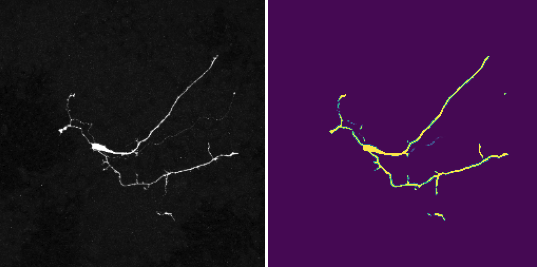

# Neuron Segmentation

This project contains a collection of Jupyter notebooks for performing semantic segmentation on neuron microscopy datasets in both 3D and 2D, using U-Net and ViT based models.

## Overview:

Neuron segmentation is a challenging task due to the branch-like structure of dendrites and axons, which makes it difficult to accurately delineate neurons. In this project, I compare the following models:

- **CNN-based U-Net**: A convolutional neural network architecture widely used for segmentation tasks.
- **ViT-based SAM**: A Vision Transformer model from Meta’s Segment Anything Model which is fine-tuned on a neuron-specific dataset to improve performance.

Project Features:

- **Pre-processing**: Steps for preprocessing microscopy images before training the models.
- **Model Training**: Building and training the U-Net model with Pytorch.
- **Fine-tuning**: Demonstrates the fine-tuning process of the SAM model on a neuron-specific dataset.
- **Inference and Metrics**: Includes code for running inference and evaluating model performance using standard metrics (IoU, Dice coefficient).
- **Bonus Method**: A comparison with a naive thresholding algorithm, a classical computer vision method for segmentation, which shows its limitations compared to deep learning approaches.
